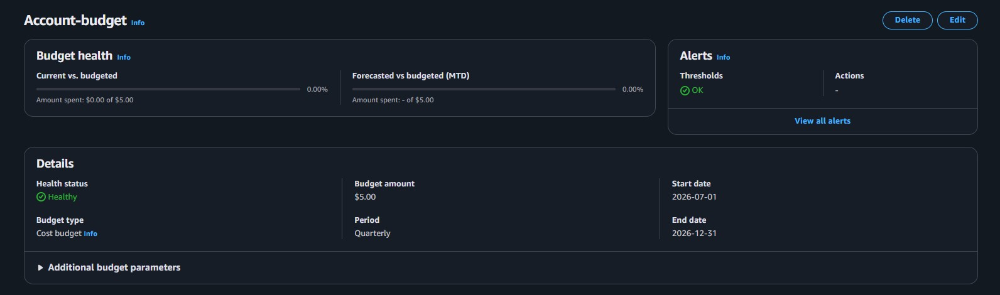
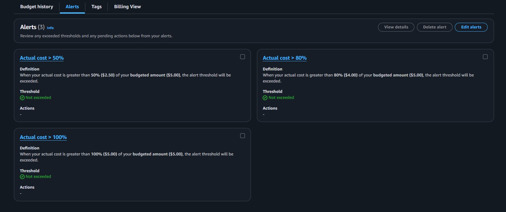
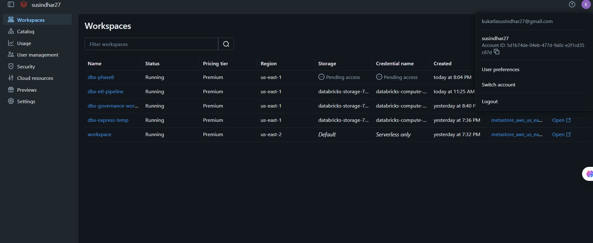

# Phase 0: Environment Setup and Synthetic Data Generation

This phase focuses on the initial setup of the capstone environment and the generation of synthetic retail datasets that will be used throughout the project. The work includes creating the base data files, setting up the AWS and Databricks environment, and preparing the project for downstream ETL and analytics steps.

## 1. Objective

The main goal of Phase 0 is to:

- prepare the project workspace for data engineering work
- create synthetic customer, product, order, order-item, and clickstream data
- establish the foundation for ingestion, profiling, and lakehouse processing

## 2. Key Deliverables

### Environment Setup

The project environment was prepared with the required cloud and analytics services, including:

- AWS budget alerts and monitoring setup
- Databricks workspace readiness
- project folder structure for data and outputs

### Synthetic Data Generation

The notebook [01_data_generation.ipynb](01_data_generation.ipynb) was used to generate the initial datasets. It creates realistic but synthetic records with intentional anomalies and schema variations so the project can demonstrate data quality checks, profiling, and ETL processing.

The generated files include:

- customers.csv
- products.csv
- orders_day1.json
- orders_day2.json
- order_items_day1.json
- order_items_day2.json
- clickstream_day1.json
- clickstream_day2.json

## 3. What the Notebook Does

The notebook performs the following tasks:

1. Creates the data folder structure
2. Generates customer and product master data
3. Produces order and order-item records for two days
4. Creates clickstream event data for user activity tracking
5. Introduces realistic data quality issues such as:
   - missing or invalid email values
   - invalid quantities
   - unknown product IDs
   - schema changes between Day 1 and Day 2

This makes the dataset suitable for later phases such as profiling, ingestion, cataloging, and lakehouse transformation.

## 4. Why This Phase Matters

Phase 1 establishes the raw data foundation for the rest of the capstone. Without this step, the downstream tasks such as profiling, S3 ingestion, Glue cataloging, Lake Formation governance, and Databricks ETL would not have meaningful input data.

## 5. Summary

Phase 1 successfully sets up the project foundation by:

- preparing the cloud and analytics environment
- generating synthetic raw datasets for the retail workflow
- creating the data assets that are used in later phases of the capstone
