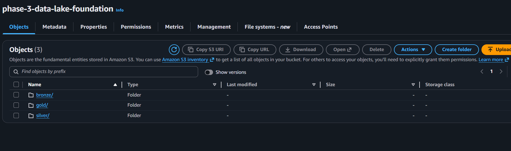
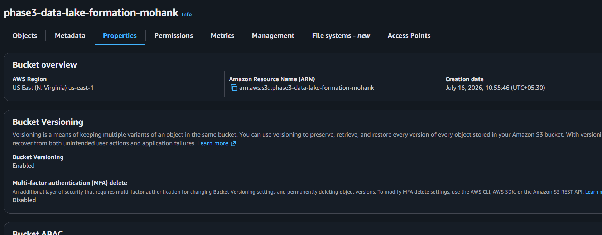
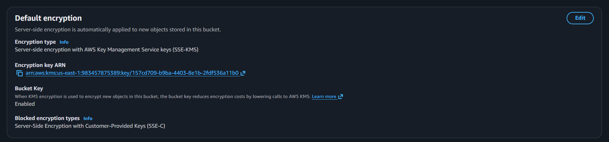
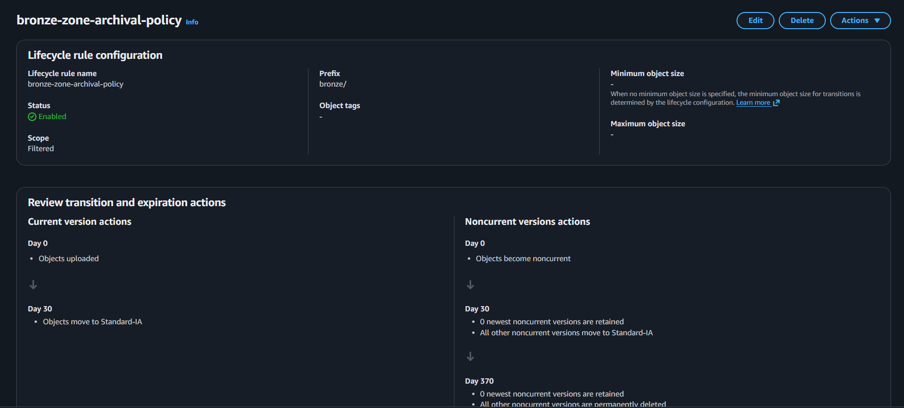
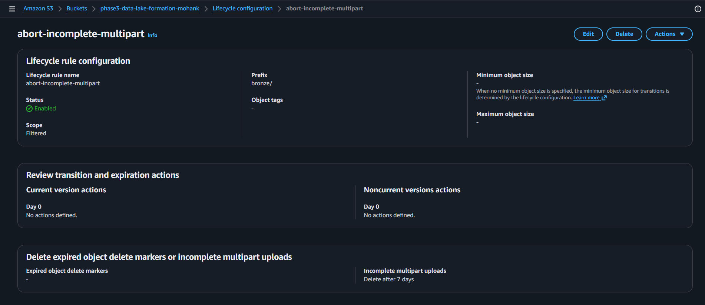
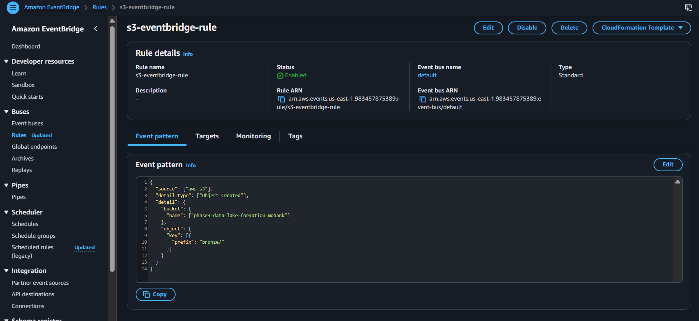
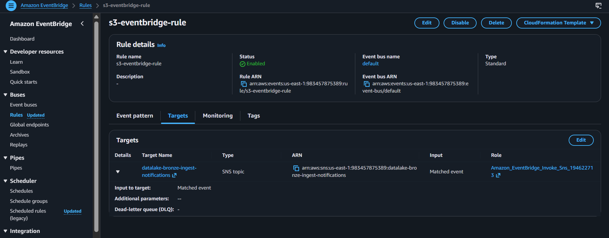
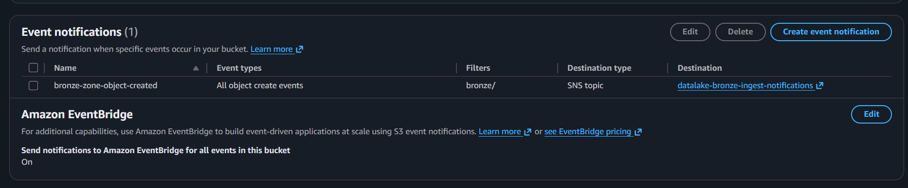

# Phase 3: Data Lake Bucket Architecture

This document describes the S3 bucket structure created in Phase 3 and the lifecycle and data management rules applied to support the medallion-style data lake.

## Bucket Overview

Bucket name: `phase3-data-lake-formation-mohank`

Region: `us-east-1` (N. Virginia)

The bucket is organized into three main zones, matching the Bronze/Silver/Gold medallion architecture:

- `bronze/` - Raw ingest data and landing zone for source files
- `silver/` - Curated and cleaned data for downstream processing
- `gold/` - Business-ready datasets for reporting and analytics

## Zone Details

### bronze/
- Landing zone for raw data ingestion
- Stores original source files without transformation
- Used for auditability, replay, and reprocessing

### silver/
- Stores curated data after validation and standardization
- Data is cleaned and made consistent before analytics

### gold/
- Stores consumption-ready datasets, aggregates, and reports
- Optimized for BI and dashboard use cases

## Security and Data Protection

### Versioning
- Bucket versioning is enabled
- This ensures that multiple object versions are preserved
- Versioning supports recovery from accidental overwrites or deletions

### Encryption
- Default server-side encryption is enabled with AWS KMS (SSE-KMS)
- A KMS key ARN is used to encrypt all new objects
- Bucket Key is enabled to reduce KMS request costs

## Lifecycle and Management Rules

The bucket includes lifecycle rules for managing storage costs and cleanup.

### `bronze-zone-archival-policy`
- Scope: filtered to the `bronze/` prefix
- Current version actions:
  - Day 0: objects are uploaded and available in standard storage
  - Day 30: objects transition to Standard-Infrequent Access (Standard-IA)
- Noncurrent version actions:
  - Day 0: objects become noncurrent
  - Day 30: all other noncurrent versions move to Standard-IA
  - Day 370: noncurrent versions are permanently deleted

### `abort-incomplete-multipart`
- Scope: filtered to the `bronze/` prefix
- No current or noncurrent version transitions required
- Deletes incomplete multipart uploads after 7 days
- Helps prevent stale multipart uploads from consuming storage

## Event Notification and Automation

The bucket is configured to send object-level events from the `bronze/` prefix into EventBridge for automated processing and integration.

### EventBridge Rule
- Captures S3 object creation events under the `bronze/` prefix
- Uses an event pattern to match `s3:ObjectCreated:*` notifications
- Enables automated workflows when new raw data lands in the bucket

### EventBridge Target
- Delivers matched events to the configured target for downstream processing
- Ensures the ingestion pipeline responds automatically to new S3 objects
- Supports event-driven processing, notifications, or Lambda-based workflows

### S3 Event Notification
- The S3 bucket event notification configuration is wired to publish the relevant events into EventBridge
- This is the bridge between S3 and the event-driven pipeline

## Summary of Rules

- `Versioning`: enabled for object version retention and recovery
- `Encryption`: SSE-KMS enabled with bucket key
- `Lifecycle`: bronze prefix archived to Standard-IA after 30 days
- `Lifecycle`: incomplete multipart uploads deleted after 7 days

This bucket structure and rules enforce a secure, resilient, and cost-managed data lake foundation for Phase 3.
