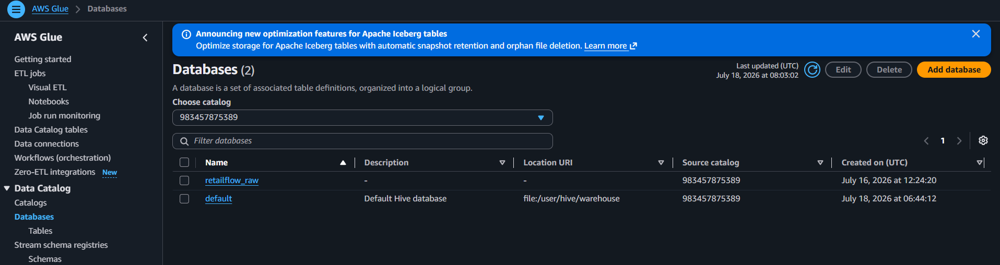
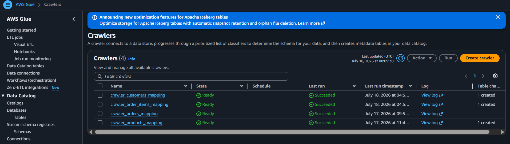
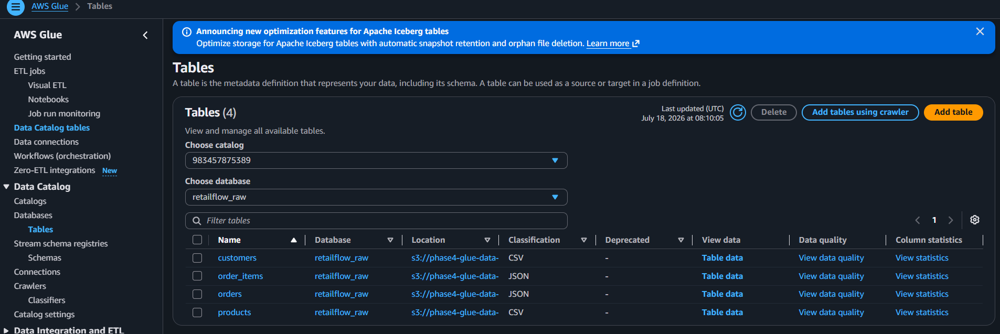
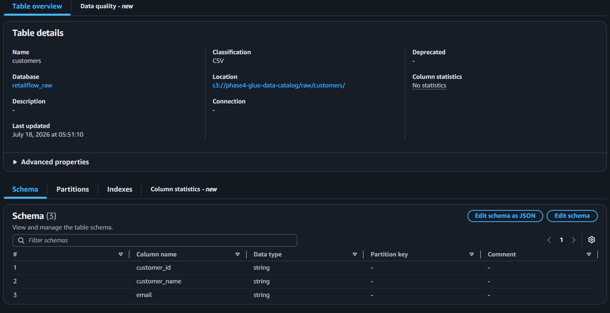
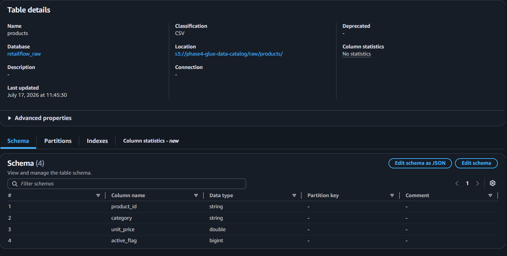
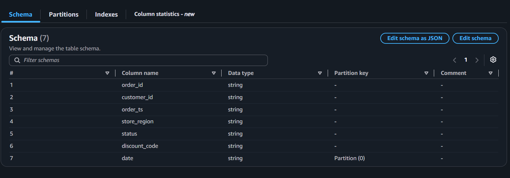
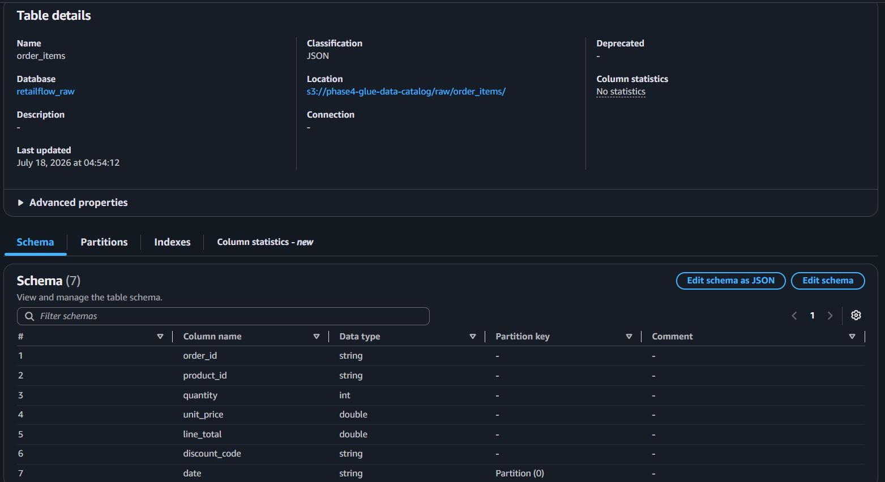
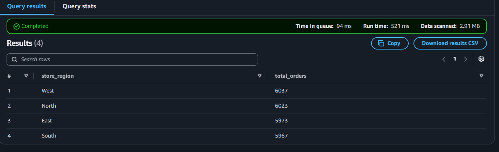
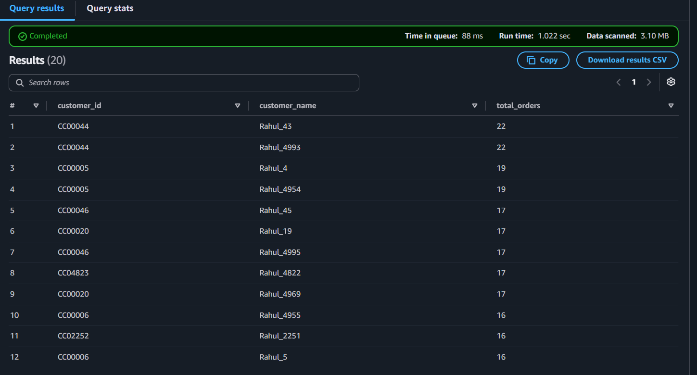
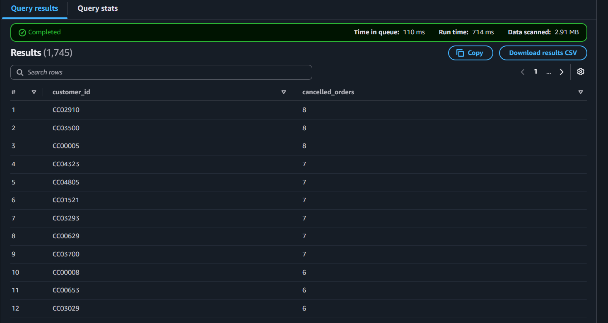

# Phase 4: AWS Glue Data Catalog & Query Results

This document captures the Phase 4 AWS Glue implementation, including the raw database, crawlers, tables, and the sample analytics queries and outputs.

## Phase 4 Data Catalog Database

The Glue Data Catalog contains a dedicated database for the raw retail data landing zone.

- Database name: `retailflow_raw`
- Catalog: `983457875389`
- Data location: `s3://phase4-glue-data-.../`

## Crawlers and Table Creation

Four Glue crawlers were created to automatically discover schemas and populate the Glue Data Catalog tables from the raw S3 data.

The crawlers are:

- `crawler_customers_mapping`
- `crawler_order_items_mapping`
- `crawler_orders_mapping`
- `crawler_products_mapping`

Each crawler is configured to scan the appropriate S3 prefix and create the matching table in the `retailflow_raw` database.

## Discovered Tables

The crawlers produced four tables in the `retailflow_raw` database:

- `customers`
- `order_items`
- `orders`
- `products`

These tables were discovered from the raw S3 objects and registered with the Glue Data Catalog.

## Table Details

### Customers Table
- File format: CSV
- Schema discovered from the raw customer dataset

### Products Table
- File format: CSV
- Schema discovered from raw product metadata

### Orders Table
- File format: JSON
- Schema discovered from raw order events
- Partitioned by date to support time-based query performance and incremental processing

### Order Items Table
- File format: JSON
- Schema discovered from raw order line-item events
- Partitioned by date to support time-based query performance and incremental processing

## Sample Queries and Results

Phase 4 includes sample SQL analytics executed against the Glue-managed tables.

### Query 1: Region-wise Order Distribution

This query calculates total orders by store region.

Result:

### Query 2: Top Customers by Number of Orders

This query identifies the highest-order customers.

Result:

### Query 3: Customers with Cancelled Orders

This query filters customers who have cancelled orders.

Result:

## Summary

Phase 4 demonstrates a complete Glue data ingestion and discovery flow:

1. Raw datasets are stored in S3.
2. Glue crawlers scan the raw data and infer schema.
3. The Glue Data Catalog database `retailflow_raw` stores table metadata.
4. Query results validate that the discovered data is available for analytics.
