# Phase 5: Lake Formation and Analytics Permissions

This document summarizes the Phase 5 AWS Lake Formation setup, including resource registration, LF tags, user roles, permissions, and Athena query access.

## Lake Formation Resource Registration

The raw data lake resources are registered in AWS Lake Formation to manage access centrally.

- Registered database: `retailflow_raw`
- Registered tables from the raw data catalog

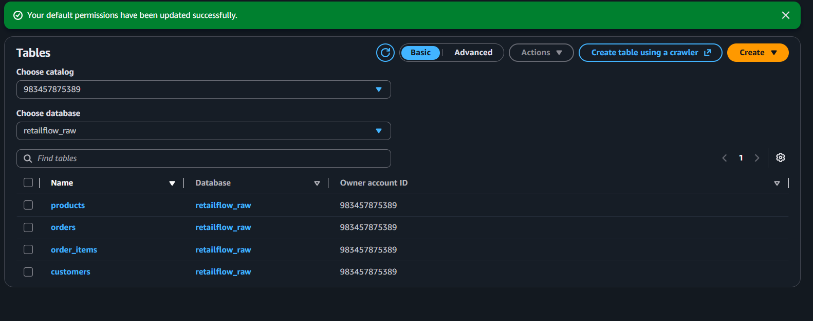

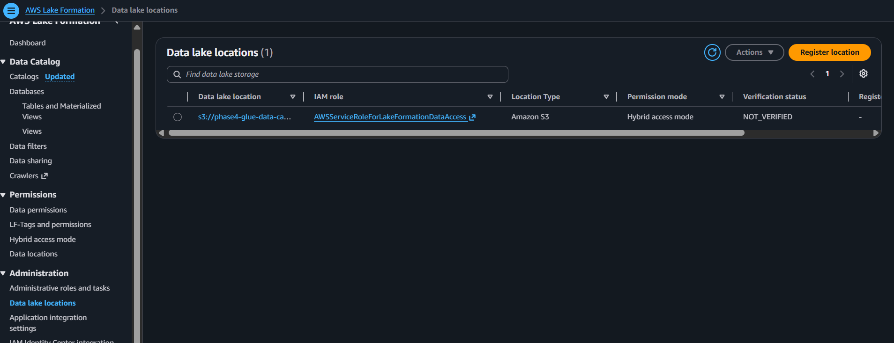

## Lake Formation Tags

Lake Formation tags are used to classify data assets and drive fine-grained access control.

- `order_table_tags` are applied to the orders table
- The `customers` table was updated to use a column-level tag on the `email` field with `datasensitivity=PII` instead of a broader table-level tag like `confidential`
- Tags are updated and propagated for consistent permissions

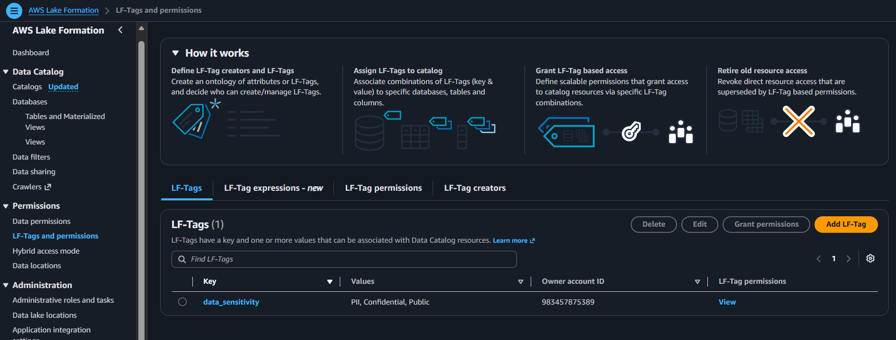

## orders table: 
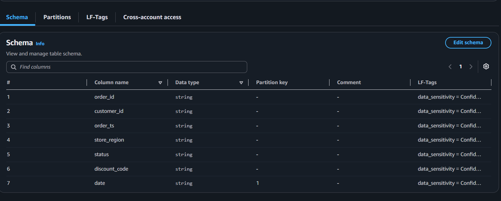

## customers table:
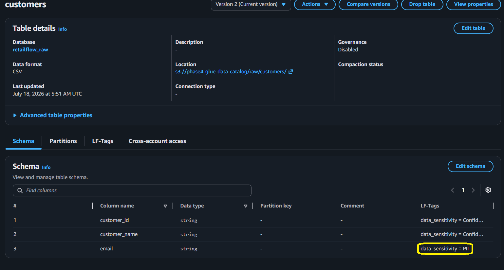

## IAM Users and Roles

Phase 5 includes distinct user identities for analytics and engineering personas.

- Data Engineer user
- Data Analyst user
- Administrative role with privileged Lake Formation and Glue access

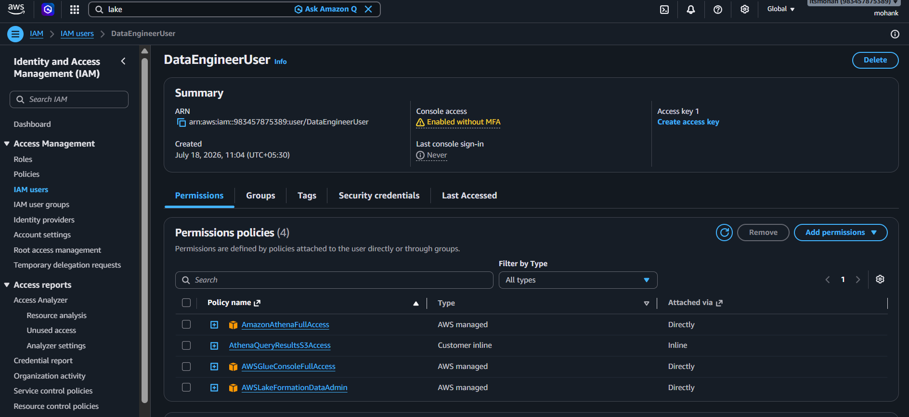

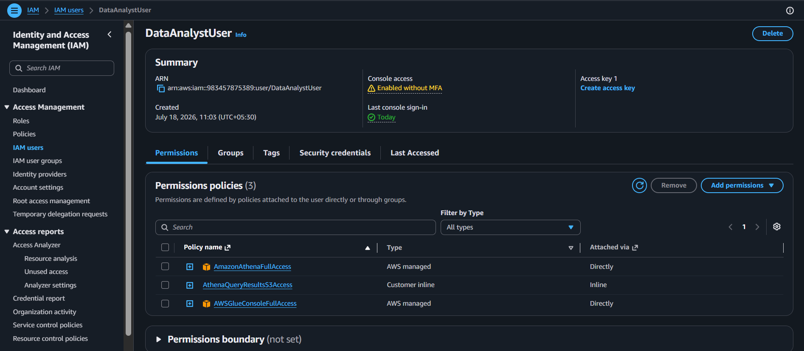

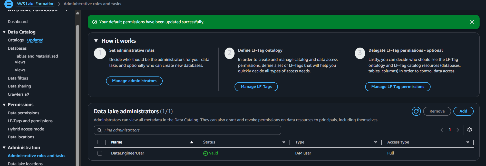

## Data Permissions

Lake Formation permissions are configured to grant the correct access level to each persona.

- Analysts receive read/query permissions on curated and consumption tables
- Engineers receive broader access for ingestion, transformation, and metadata management

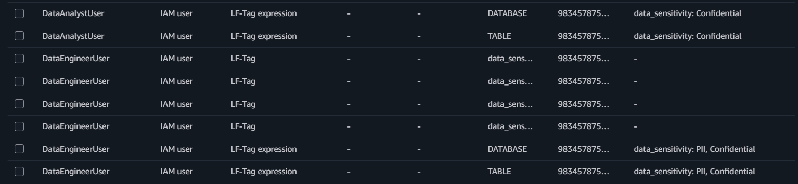

## Athena Query Validation

Athena queries are executed against the Lake Formation-managed tables to validate access and data readability.

In this validation, I am logged in as the Data Analyst user. The Data Analyst user is intentionally restricted from viewing the sensitive `email` column because the Lake Formation tag `datasensitivity=PII` is not granted to that persona. This demonstrates fine-grained column-level governance, where the analyst can query permitted data but cannot access personally identifiable information.

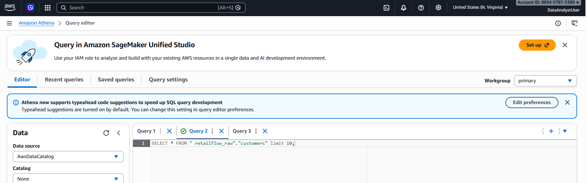

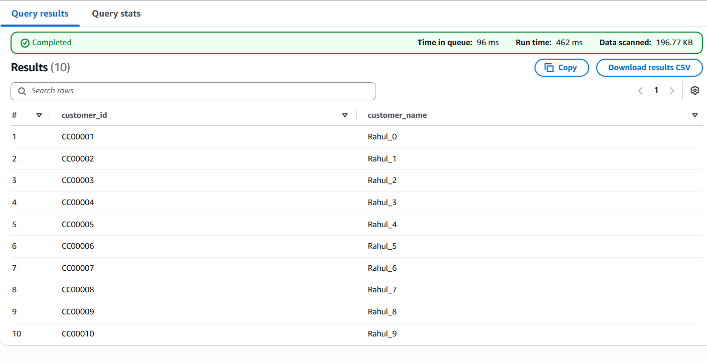

## Summary

Phase 5 confirms the Lake Formation governance layer is in place with:

1. Registered raw data locations and tables
2. Lake Formation tags for classification
3. User identities and roles for Data Engineer, Data Analyst, and Admin
4. Permission enforcement for governed data access
5. Athena query validation against governed resources
