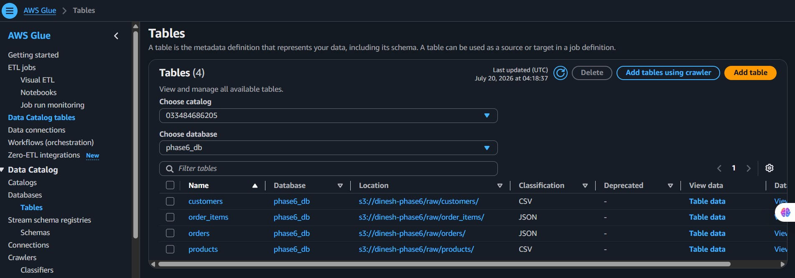
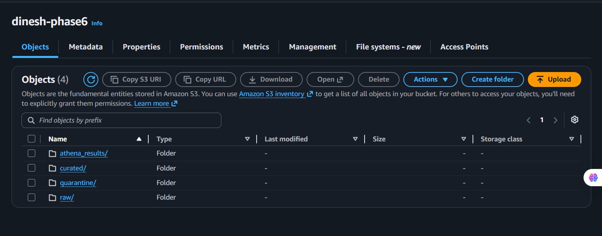
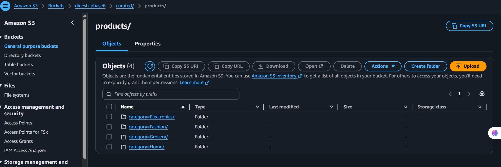
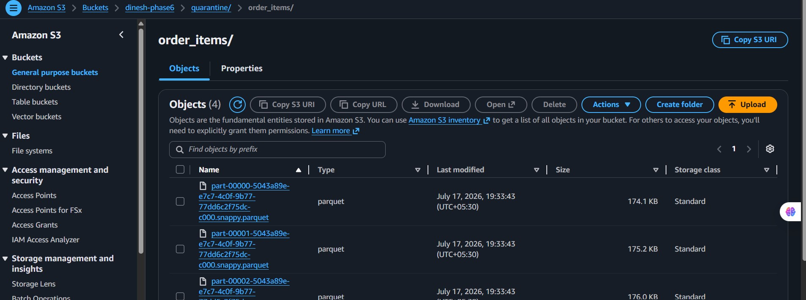
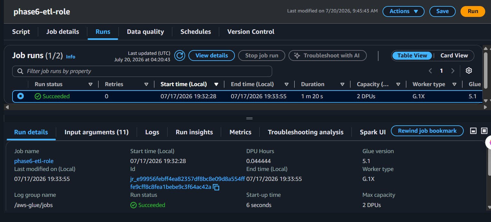
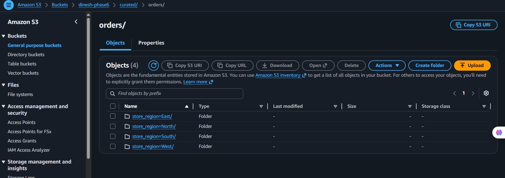

# Phase 6: Glue ETL Job for Curated Data and Quarantine Handling

This phase demonstrates a Glue-based ETL workflow that takes data from the Glue Catalog, cleans and standardizes it, and writes curated outputs to Amazon S3. The implementation is driven by [phase6.py](phase6.py) and shows how a production-style data pipeline can separate valid records from invalid ones.

## 1. Objective

The main goal of Phase 6 is to:

- read raw business tables from the Glue Catalog
- apply basic data quality rules such as null handling and type casting
- deduplicate records where needed
- enforce referential integrity by keeping only valid order items
- write curated data into partitioned S3 folders and quarantine bad rows separately

## 2. What the ETL Job Does

The Glue job in [phase6.py](phase6.py) performs the following steps:

1. Reads the tables customers, products, orders, and order_items from the Glue Catalog.
2. Converts the Glue DynamicFrames into Spark DataFrames for transformation.
3. Fills missing email values with a default placeholder.
4. Casts numeric columns to the appropriate types for downstream processing.
5. Removes duplicate order records and duplicate order-item rows.
6. Validates order-item records against the list of valid product IDs.
7. Writes valid rows to curated S3 paths and invalid rows to a quarantine location.
8. Commits the job successfully after the ETL completes.

## 3. End-to-End Flow

### Step 1: Read from Glue Catalog

The ETL job starts by reading the required tables from the Glue Data Catalog. This is the starting point for the pipeline and ensures that the job is working with catalog-managed datasets.

This screenshot shows the catalog tables used by the job. In this project, the tables represent customers, products, orders, and order items that will be processed together.

### Step 2: Transform the Data

Once the tables are loaded, the job applies transformations to improve data quality:

- missing email values are filled with UNKNOWN
- numeric fields such as unit price, quantity, and line total are cast to the correct Spark types
- duplicate records are removed to prevent repeated rows from contaminating downstream reporting

These transformations make the data cleaner and more reliable before it is written out.

### Step 3: Enforce Referential Integrity

A key business rule in this workflow is that order items must point to valid products. The job checks whether each order item references a product ID that exists in the products table.

- valid order items are retained for curated output
- invalid order items are pushed to quarantine

This is an important data quality control step because it prevents bad records from flowing into the curated layer.

### Step 4: Write Curated Data to S3

The clean records are written to curated S3 locations. The output is organized in a structured folder layout that makes it easier for downstream analytics workloads to consume.

The screenshot shows the overall S3 layout used by the ETL job. The curated destination stores cleaned, transformed data, while the quarantine destination stores rejected rows for inspection.

### Step 5: Partition the Curated Outputs

The job writes partitioned Parquet files for the curated data. Partitioning improves query performance and makes the dataset more organized for analytics.

The products output is partitioned by category, which is a good example of how the curated layer is organized for efficient downstream use.

### Step 6: Store Quarantine Data Separately

Invalid or broken rows are not lost. Instead, they are written to a quarantine path so they can be reviewed and corrected later.

This quarantine folder captures the records that failed referential integrity checks, making the workflow auditable and easier to troubleshoot.

### Step 7: Completed Job Run

The Glue job completes successfully after the ETL run. This confirms that the transformation logic executed without errors and that the curated outputs were written.

## 4. Curated Output Examples

The ETL produces curated data for the main business entities:

- customers
- products
- orders
- order items

Some of the outputs are partitioned by business-relevant fields such as category and region, while the quarantine output is stored separately for review.

This screenshot shows the transformed orders output, highlighting that the curated data is delivered in a structured, partitioned fashion ready for further analytics.

## 5. Why This Phase Matters

Phase 6 is important because it shows the transition from raw catalog data to a more trustworthy curated dataset. It introduces practical data engineering practices such as:

- transformation and standardization
- deduplication
- quality control through referential integrity
- partitioned storage for performance
- quarantine handling for invalid records

In short, this phase demonstrates a simple but practical ETL pattern that prepares data for analytics while keeping data quality safeguards in place.
