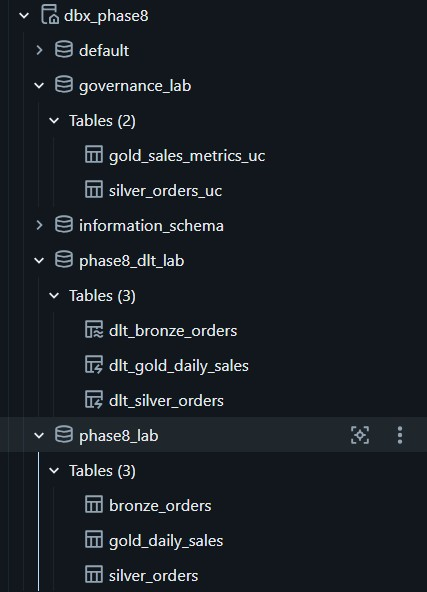
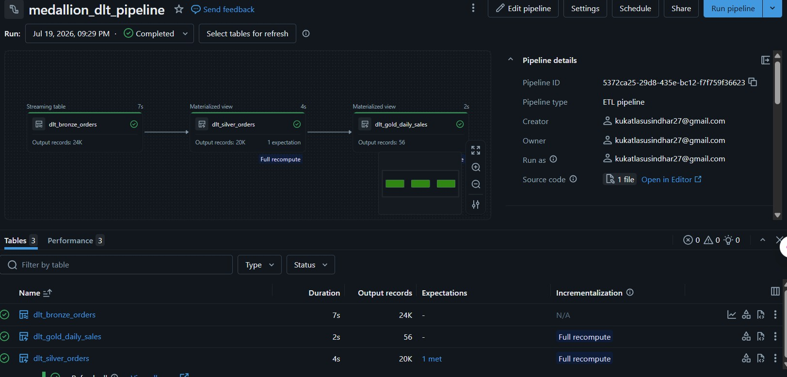
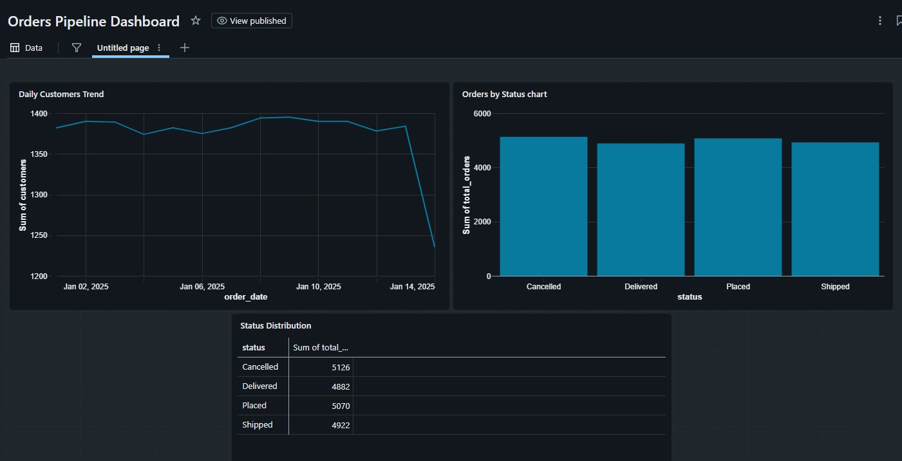
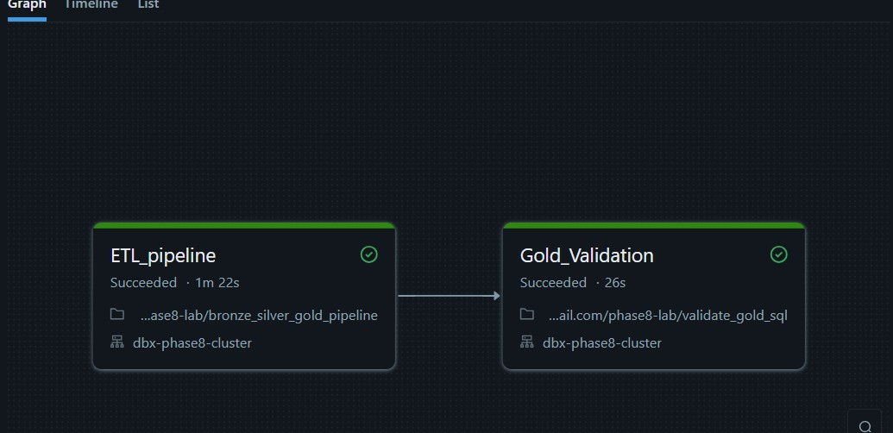
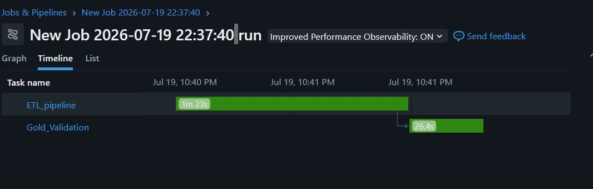

# Phase 8: Databricks Medallion ETL Pipeline and Lakehouse Validation

This phase demonstrates the end-to-end Databricks-based ETL workflow for the retail data project. The implementation uses a medallion architecture to move raw order data from Amazon S3 into curated Delta tables and then into business-ready analytics tables.

## 1. Objective

The goal of Phase 8 is to:

- ingest raw order data from S3 into Databricks
- build a Bronze → Silver → Gold pipeline
- apply data quality rules and deduplication
- create business metrics for reporting and dashboarding
- validate the final Gold tables using Databricks SQL

## 2. Notebooks Used

The implementation is organized around the following notebooks:

- [bronze_silver_gold_pipeline.ipynb](bronze_silver_gold_pipeline.ipynb) — manual streaming pipeline for Bronze, Silver, and Gold tables
- [medallion_dlt.ipynb](medallion_dlt.ipynb) — declarative Delta Live Tables (DLT) pipeline for the medallion architecture
- [validate_gold_sql.ipynb](validate_gold_sql.ipynb) — SQL validation of the Gold analytics output

## 3. Architecture Overview

The ETL flow follows the medallion pattern:

1. Raw data lands in S3
2. Databricks ingests the data into Bronze tables
3. Silver tables clean, standardize, and deduplicate the data
4. Gold tables aggregate the curated data into daily business metrics
5. The output is validated and exposed for analytics and dashboard use

## 4. ETL Flow Explanation

### Step 1: Raw Data Ingestion

The raw order files are stored in an S3 location under the raw bucket. Databricks reads these files using Auto Loader / CloudFiles, which supports incremental ingestion efficiently.

Key actions:

- identify incoming files in S3
- ingest them into the Bronze layer
- preserve source metadata such as file path and ingestion timestamp

This creates a near-real-time record of the raw data as it arrives.

### Step 2: Bronze Layer

The Bronze layer stores data in a raw but traceable form. It preserves the original payload while adding metadata for lineage and auditing.

Typical Bronze outputs include:

- raw orders data
- source file reference
- ingestion timestamp
- initial schema discovery from incoming JSON files

This layer is designed for reliability and traceability rather than business-ready quality.

### Step 3: Silver Layer

The Silver layer cleans and standardizes the Bronze data. This step applies business and data quality rules before the data is used for analytics.

Examples of Silver transformations:

- normalize status values such as Placed, Shipped, Delivered, and Cancelled
- convert timestamps into proper Datetime values
- remove null or invalid customer and order identifiers
- deduplicate records using row number logic and window functions

The result is one valid, latest record per business entity, which makes downstream reporting more trustworthy.

### Step 4: Gold Layer

The Gold layer aggregates the curated Silver data into business metrics. In this project, the gold table is used to calculate daily sales metrics such as:

- total orders per day
- distinct customers per day
- order status distribution over time

This layer is optimized for dashboards, reporting, and analytics consumption.

### Step 5: Validation and Governance

The final Gold tables are validated through Databricks SQL notebooks and optionally exposed through Unity Catalog or share-based governance patterns. This ensures that the curated data is queryable and suitable for downstream consumption.

## 5. Databricks Run and Job Execution

The pipeline was executed as a Databricks job, which allows the ETL workflow to run in a controlled and repeatable way.

Key execution artifacts include:

- job run status
- job timeline
- task execution tracking
- pipeline completion logs

## 6. Summary

Phase 8 successfully demonstrates a practical lakehouse ETL implementation using Databricks:

- raw data is ingested from S3
- Bronze preserves raw history and source metadata
- Silver improves data quality and removes duplicates
- Gold creates analytical business metrics
- Databricks jobs and SQL validation confirm the pipeline is operational

In short, the ETL flow moves from raw ingestion to trusted analytics, enabling the project to support reporting and downstream data use cases in a scalable way.
